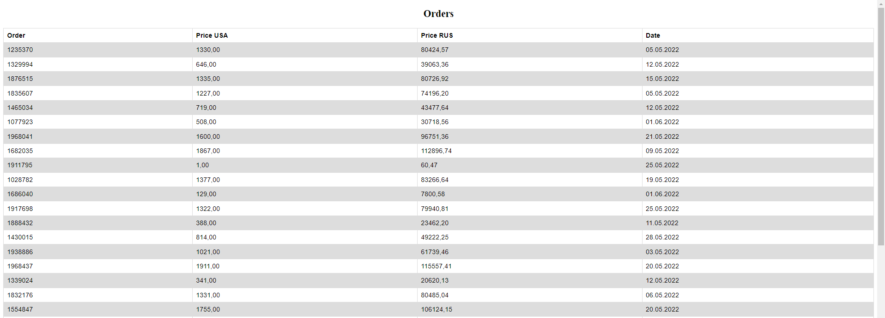

## Table of contents
* [General info](#general-info)
* [Technologies](#technologies)
* [Setup](#setup)

## General info
This project takes a Google sheet with information about orders and, by adding a column with the price in rubles, displays the table.
	
## Technologies
Project is created with:
* Django version: 4.0.3
* Redis version: 4.3.4
* Celery version: 5.2.7
	
## Setup
First you need to register in Google Cloud Platform, create and configure a new API.

After that, you need to add the credentials file to the clients folder, and Google sheet id to the .env file

To run this project localy you need to download it, and then:

```
$ cd ../project
$ docker-compose up
```
Now you can go to http://127.0.0.1:8000/list and see a new table that will respond to changes in your Google sheet.



Link to Google Sheet: https://docs.google.com/spreadsheets/d/1hmTUTWuEnhoO5VmZLjT-kHN2dbPuIV5ij2Nx6j7K-hI/edit#gid=0